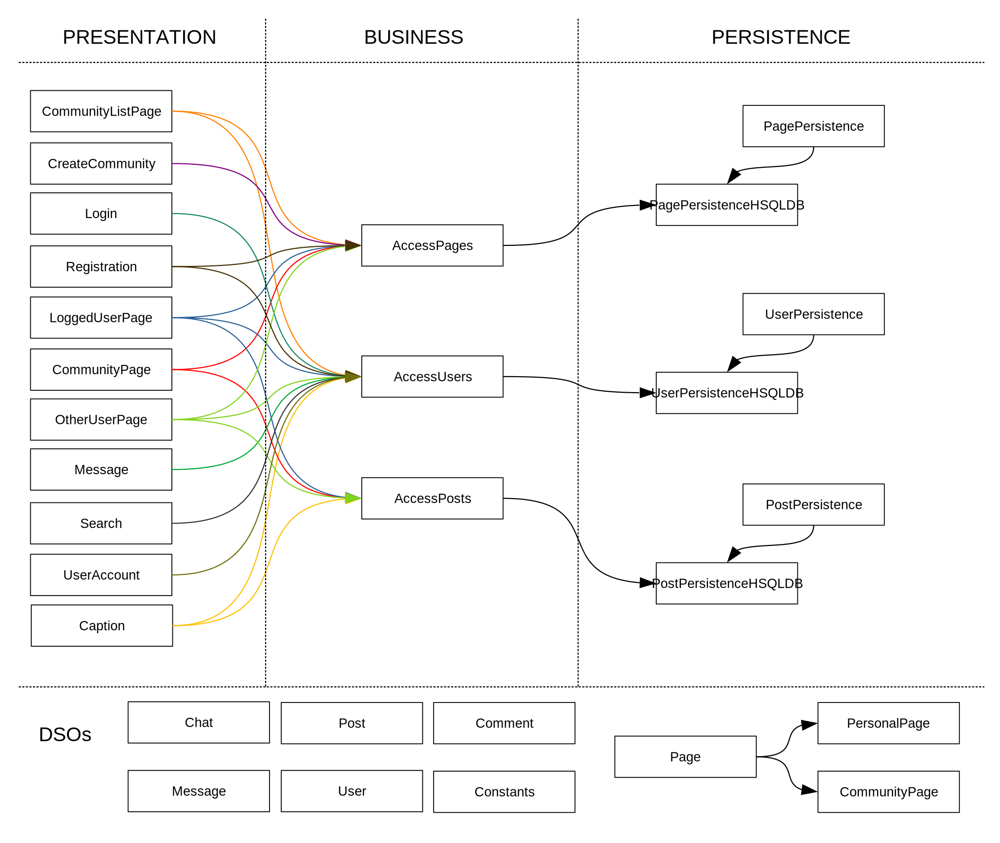

# Architecture
The architecture for SickNasty contains three layers: the Presentation, Business and Persistence layers.  
  

The Business layer will handle the interaction between the Presentation and Persistence layers. Those two layers will never communicate directly with each other  
Along side the three layers, we also have Domain Specific Objects (DSOs) that get passed around to each of the different layers.  
  
## Presentation Layer
This layer contains several different activities:
1. CaptionActivity
    - This activity is responsible for accepting a potential caption from the user after they select media from their device to post.
2. CommunityListPageActivity
    - This activity is responsible for navigation to CommunityPages. It shows a list of buttons of all the CommunityPages.
3. CommunityPageActivity
    - This activity is showcases all the Posts that were posted to this CommunityPage. It also contains the button to allow others to post to this page.
4. CreateCommunityActivity
    - This activity contains all the fields required to create a brand new CommunityPage.
5. LoggedUserPageActivity
    - This activity loads the personal page of the that is currently logged in.
6. LoginActivity
    - This activity is the landing zone for new or returning users. Existing users will login here.
7. MessageActivity
    - This activity is launched from another user's PersonalPage. It is the activity responsible for displaying and sending private messages between two people.
8. OtherUserPageActivity
    - This activity is similar to LoggedUserPageActivity, except this activity is ment for other users and does not contain a "post" or "change account details" button.
9. RegistrationActivity
    - This activity is can be launched from the LoginActivity. This is where new users come to create a new account.
10. SearchActivity
    - This activity shows the names of all Users that have accounts. Pressing on any one of the names will launch OtherUserPageActivity.
11. UserAccountActivity
    - This activity will give the user the ability to change their personal details pertaining to their user account.
  
## Business
This layer contains three different managing classes that act as the middlemen for Presentation and Persistence:
1. AccessPages
    - This manager class provides intermediate functions for the presentation layer that communicate with PagePersistence.
2. AccessPosts
    - This class provides intermediate functions for the presentation layer that communicate with PostPersistence.
3. AccessUsers
    - This class provides intermediate functions for the presentation layer that communicate with UserPersistence.
  
## Persistence
This layer contains three persistence interfaces (and their concrete classes) that save the DSOs and their information:
1. PagePersistence
    - PagePersistenceStub that contains a fake implementation of Pages using a HashMap.
    - PagePersistenceHSQLDB that contains calls to the HSQLDB driver that modifies a persistent database.
2. PostPersistence
    - PostPersistenceStub that contains a fake implementation.
    - PostPersistenceHSQLDB that contains the real calls to a persistent database.
3. UserPersistence
    - UserPersistenceStub that contains fake implementation.
    - UserPersistenceHSQLDB that contains real calls to the persistent database.
  
## Diagram

