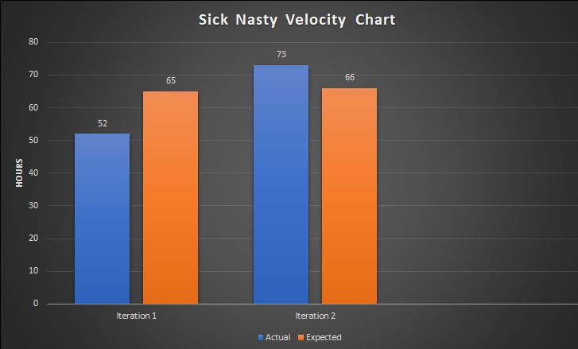

## Retrospective
Most of our issues for the past 2 iterations were related to group participation. For the next iteration we need to work on getting equal, or close to equal participation from all group members. This participation should meet the standard we have agreed on. We are working on improving this by first distributing tasks right at the start of the third iteration. This will ensure everyone knows what needs to be completed in the allotted time. Another way we are tackling this issue is by making sure that everyone comes to class from now on, and participates in our group messages as much as possible. This allows everyone to get the most recent news on what’s everyone working and if they are staying on track for release. With the developments of Covid-19, we will be shifting to more regular group discussions over Discord. We will measure this improvement's success with a two part process; firstly by how many hours in total each group member put into their tasks, and secondly how much they contributed in discussions and helped with the management of the project as a whole.  

The other issue mentioned was the quality of work each group member is doing. This mainly relates to the coding part of the course itself. By quality, we want it to be readable, and easy to understand without having to decipher code. We don’t want any hacky ways of doing certain things because while it may be easier, if we need to add things on, or even if another person needs to refactor it will make things harder (and more frustrating) in the long run. We want to emphasize SOLID principles and make sure none are being overlooked, and overall want to reduce adding any outstanding technical debt. In the previous iterations, we had made some of these mistakes. To improve this, we are going to create a programming practices guide and follow it as closely as possible. On this topic of programming practices, we also discussed improving our comments for the code we write. This helps with keeping the code more understandable. To make sure all the above mentioned things are actually being done, we made it impossible to merge directly with our main development and master branches without at least two other group members looking over the code and approving it. We can measure the successes of this by counting the number of revisions to the merge request before finally merging. Greater number of revisions would indicate more care has gone into preserving the standard.
## Velocity Chart

